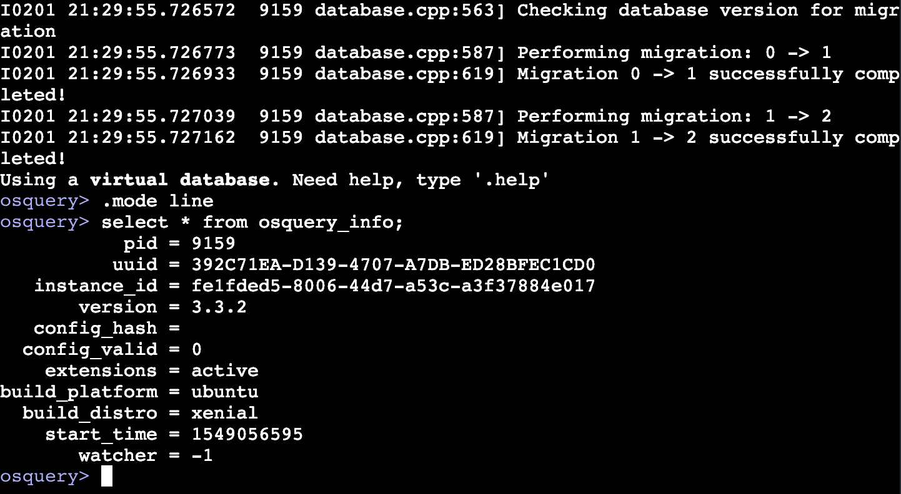

# Osquery Live [](https://circleci.com/gh/zwass/osquery-live)

Try osquery live in the browser. Runs a real osqueryi shell.

See it in action at [osquery.live](https://osquery.live).



## Development

### Dependencies

- Go >= 1.11
- Node
- Yarn
- Osquery

### Local testing

```bash
yarn install
yarn start
```

Changes in the JS code will automatically be loaded. When the Go code is changed, restart `yarn start`.
